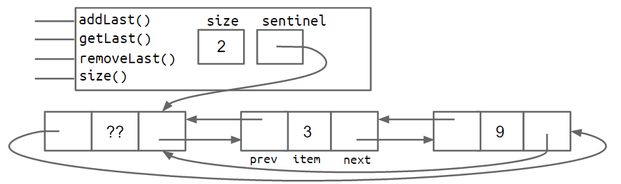
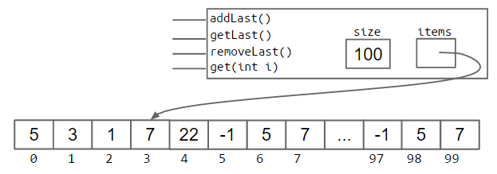
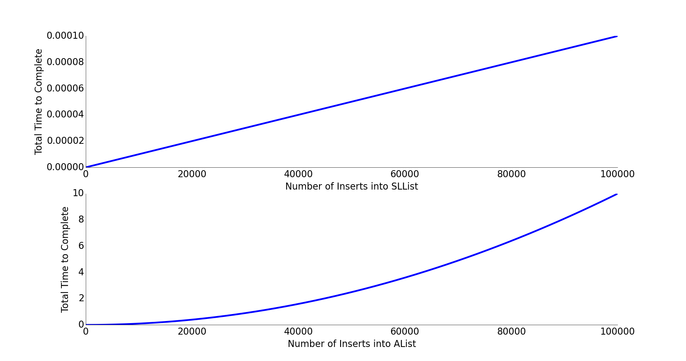
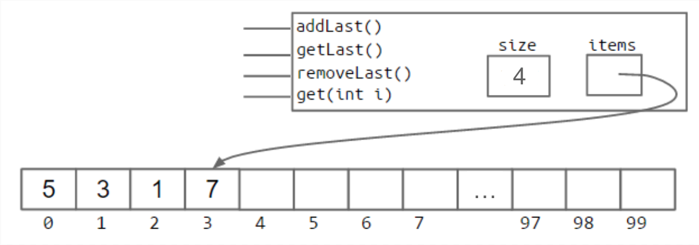

# The Array List

## Arrays

So far, we've seen how to harness recursive class definitions to create an expandable list class, including the `IntList`, `SLList`, and `DLList`. In the next two sections of this book, we'll discuss how to build a list class using arrays.

This section of this book assumes you've already worked with arrays and is not intended to be a comprehensive guide to their syntax.

## Array Basics

To ultimately build a list that can hold information, we need some way to get memory boxes. Prevously, we saw how we could get memory boxes with variable declarations and class instantiations. For example:

* `int x;` gives us a 32 bit memory box that stores ints.
* `Walrus w1;` gives us a 64 bit memory box that stores Walrus references.
* `Walrus w2 = new Walrus(30, 5.6);` gets us 3 total memory boxes. One 64 bit box that stores Walrus references, one 32 bit box that stores the int size of the Walrus, and a 64 bit box that stores the double tuskSize of the Walrus.

Arrays are a special type of object that consists of a numbered sequence of memory boxes. This is unlike class instances, which have named memory boxes. To get the ith item of an array, we use bracket notation as we saw in HW0 and Project 0, e.g. `A[i]` to get the `i`th element of A.

Arrays consist of:

* A fixed integer length, N
* A sequence of N memory boxes \(N = length\) where all boxes are of the same type, and are numbered 0 through N - 1.

Unlike classes, arrays do not have methods.

### Array Creation


There are three valid notations for array creation. Try running the code below and see what happens. Click \[here\]\([http://pythontutor.com/iframe-embed.html\#code=public class ArrayCreationDemo %7B%0A  public static void main\(String%5B%5D args%29 %7B%0A    int%5B%5D x%3B%0A    int%5B%5D y%3B%0A    x %3D new int%5B3%5D%3B%0A    y %3D new int%5B%5D%7B1, 2, 3, 4, 5%7D%3B%0A    int%5B%5D z %3D %7B9, 10, 11, 12, 13%7D%3B%0A%09%7D%0A%7D&codeDivHeight=400&codeDivWidth=350&cumulative=false&curInstr=0&heapPrimitives=false&origin=opt-frontend.js&py=java&rawInputLstJSON=%5B%5D&textReferences=false](http://pythontutor.com/iframe-embed.html#code=public%20class%20ArrayCreationDemo%20%7B%0A%20%20public%20static%20void%20main%28String%5B%5D%20args%29%20%7B%0A%20%20%20%20int%5B%5D%20x%3B%0A%20%20%20%20int%5B%5D%20y%3B%0A%20%20%20%20x%20%3D%20new%20int%5B3%5D%3B%0A%20%20%20%20y%20%3D%20new%20int%5B%5D%7B1,%202,%203,%204,%205%7D%3B%0A%20%20%20%20int%5B%5D%20z%20%3D%20%7B9,%2010,%2011,%2012,%2013%7D%3B%0A%09%7D%0A%7D&codeDivHeight=400&codeDivWidth=350&cumulative=false&curInstr=0&heapPrimitives=false&origin=opt-frontend.js&py=java&rawInputLstJSON=%5B%5D&textReferences=false)\) for an interactive visualization.

* `x = new int[3];`
* `y = new int[]{1, 2, 3, 4, 5};`
* `int[] z = {9, 10, 11, 12, 13};`

All three notations create an array. The first notation, used to create `x`, will create an array of the specified length and fill in each memory box with a default value. In this case, it will create an array of length 3, and fill each of the 3 boxes with the default `int` value `0`.

The second notation, used to create `y`, creates an array with the exact size needed to accommodate the specified starting values. In this case, it creates an array of length 5, with those five specific elements.

The third notation, used to declare **and** create `z`, has the same behavior as the second notation. The only difference is that it omits the usage of `new`, and can only be used when combined with a variable declaration.

None of these notations is better than any other.

### Array Access and Modification

The following code showcases all of the key syntax we'll use to work with arrays. Try stepping through the code below and making sure you understand what happens when each line executes. To do so, click [here](https://goo.gl/bertuh) for an interactive visualization. With the exception of the final line of code, we've seen all of this syntax before.

```java
int[] z = null;
int[] x, y;

x = new int[]{1, 2, 3, 4, 5};
y = x;
x = new int[]{-1, 2, 5, 4, 99};
y = new int[3];
z = new int[0];
int xL = x.length;

String[] s = new String[6];
s[4] = "ketchup";
s[x[3] - x[1]] = "muffins";

int[] b = {9, 10, 11};
System.arraycopy(b, 0, x, 3, 2);
```

The final line demonstrates one way to copy information from one array to another. `System.arraycopy` takes five parameters:

* The array to use as a source
* Where to start in the source array
* The array to use as a destination
* Where to start in the destination array
* How many items to copy

For Python veterans, `System.arraycopy(b, 0,x, 3, 2)` is the equivalent of `x[3:5] = b[0:2]` in Python.

An alternate approach to copying arrays would be to use a loop. `arraycopy` is usually faster than a loop, and results in more compact code. The only downside is that `arraycopy` is \(arguably\) harder to read. Note that Java arrays only perform bounds checking at runtime. That is, the following code compiles just fine, but will crash at runtime.

```java
int[] x = {9, 10, 11, 12, 13};
int[] y = new int[2];
int i = 0;
while (i < x.length) {
    y[i] = x[i];
    i += 1;
}
```

Try running this code locally in a java file or in the [visualizer](https://goo.gl/YHufJ6). What is the name of the error that you encounter when it crashes? Does the name of the error make sense?

### 2D Arrays in Java


What one might call a 2D array in Java is actually just an array of arrays. They follow the same rules for objects that we've already learned, but let's review them to make sure we understand how they work.

Syntax for arrays of arrays can be a bit confusing. Consider the code `int[][] bamboozle = new int[4][]`. This creates an array of integer arrays called `bamboozle`. Specifically, this creates exactly four memory boxes, each of which can point to an array of integers \(of unspecified length\).

Try running the code below line-by-lines, and see if the results match your intuition. For an interactive visualization, click [here](http://goo.gl/VS4cOK).

```java
int[][] pascalsTriangle;
pascalsTriangle = new int[4][];
int[] rowZero = pascalsTriangle[0];

pascalsTriangle[0] = new int[]{1};
pascalsTriangle[1] = new int[]{1, 1};
pascalsTriangle[2] = new int[]{1, 2, 1};
pascalsTriangle[3] = new int[]{1, 3, 3, 1};
int[] rowTwo = pascalsTriangle[2];
rowTwo[1] = -5;

int[][] matrix;
matrix = new int[4][];
matrix = new int[4][4];

int[][] pascalAgain = new int[][]{{1}, {1, 1},
                                 {1, 2, 1}, {1, 3, 3, 1}};
```

**Exercise 2.4.1:** After running the code below, what will be the values of x\[0\]\[0\] and w\[0\]\[0\]? Check your work by clicking [here](http://goo.gl/fCZ9Dr).

```java
int[][] x = {{1, 2, 3}, {4, 5, 6}, {7, 8, 9}};

int[][] z = new int[3][];
z[0] = x[0];
z[1] = x[1];
z[2] = x[2];
z[0][0] = -z[0][0];

int[][] w = new int[3][3];
System.arraycopy(x[0], 0, w[0], 0, 3);
System.arraycopy(x[1], 0, w[1], 0, 3);
System.arraycopy(x[2], 0, w[2], 0, 3);
w[0][0] = -w[0][0];
```

### Linked List Performance Puzzle

Suppose we wanted to write a new method for `DLList` called `int get(int i)`. Why would `get` be slow for long lists compared to `getLast`? For what inputs would it be especially slow?

You may find the figure below useful for thinking about your answer.



### Linked List Performance Puzzle Solution

It turns out that no matter how clever you are, the `get` method will usually be slower than `getBack` if we're using the doubly linked list structure described in section 2.3.

This is because, since we only have references to the first and last items of the list, we'll always need to walk through the list from the front or back to get to the item that we're trying to retrieve. For example, if we want to get item \#417 in a list of length 10,000, we'll have to walk across 417 forward links to get to the item we want.

In the very worst case, the item is in the very middle and we'll need to walk through a number of items proportional to the length of the list \(specifically, the number of items divided by two\). In other words, our worst case execution time for `get` is linear in the size of the entire list. This in contrast to the runtime for `getBack`, which is constant, no matter the size of the list. Later in the course, we'll formally define runtimes in terms of big O and big Theta notation. For now, we'll stick to an informal understanding.

### Our First Attempt: The Naive Array Based List

Accessing the `i`th element of an array takes constant time on a modern computer. This suggests that an array-based list would be capable of much better performance for `get` than a linked-list based solution, since it can simply use bracket notation to get the item of interest.

If you'd like to know **why** arrays have constant time access, check out this [Quora post](https://www.quora.com/Why-does-accessing-an-array-element-take-constant-time).

Using an array, we might end up with a class like this:

```java
public class AList {
    private int[] items;
    private int size;

    /** Creates an empty list. */
    public AList() {
        items = new int[100];
        size = 0;
    }

    /** Inserts X into the back of the list. */
    public void addLast(int x) {
        items[size] = x;
        size = size + 1;
    }

    /** Returns the item from the back of the list. */
    public int getLast() {
        return items[size - 1];
    }
    /** Gets the ith item in the list (0 is the front). */
    public int get(int i) {
        return items[i];
    }

    /** Returns the number of items in the list. */
    public int size() {
        return size;
    }

    /** Deletes item from back of the list and
      * returns deleted item. */
    public int removeLast() {
        int x = getLast();
        size = size - 1;
        return x;
    }
} 
```

### Naive Resizing Arrays

**Optional Exercise 2.5.3:** Suppose we have an AList in the state shown in the figure below. What will happen if we call `addLast(11)`? What should we do about this problem?




The answer, in Java, is that we simply build a new array that is big enough to accomodate the new data. For example, we can imagine adding the new item as follows:

```java
int[] a = new int[size + 1];
System.arraycopy(items, 0, a, 0, size);
a[size] = 11;
items = a;
size = size + 1;
```

The process of creating a new array and copying items over is often referred to as "resizing". It's a bit of a misnomer since the array doesn't actually change size, we are just making a **new** one that has a bigger size.

The resulting AList is as follows:

```java
public class AList<Item> {
    private Item[] items;
    private int size;

    /** Creates an empty list. */
    public AList() {
        items = (Item[]) new Object[100];
        size = 0;
    }

    /** Resizes the underlying array to the target capacity. */
    private void resize(int capacity) {
        Item[] a = (Item[]) new Object[capacity];
        System.arraycopy(items, 0, a, 0, size);
        items = a;
    }

    /** Inserts X into the back of the list. */
    public void addLast(Item x) {
        if (size == items.length) {
            resize(size + 1);
        }

        items[size] = x;
        size = size + 1;
    }

    /** Returns the item from the back of the list. */
    public Item getLast() {
        return items[size - 1];
    }
    /** Gets the ith item in the list (0 is the front). */
    public Item get(int i) {
        return items[i];
    }

    /** Returns the number of items in the list. */
    public int size() {
        return size;
    }

    /** Deletes item from back of the list and
      * returns deleted item. */
    public Item removeLast() {
        Item x = getLast();
        items[size - 1] = null;
        size = size - 1;
        return x;
    }
} 
```

### Analyzing the Naive Resizing Array

The approach that we attempted in the previous section has terrible performance. By running a simple computational experiment where we call `addLast` 100,000 times, we see that the `SLList` completes so fast that we can't even time it. By contrast our array based list takes several seconds.

To understand why, consider the following exercise:

Optioanl exercise: Suppose we have an array of size 100. If we call insertBack two times, how many total boxes will we need to create and fill throughout this entire process? How many total boxes will we have at any one time, assuming that garbage collection happens as soon as the last reference to an array is lost?

Optional exercise: Starting from an array of size 100, approximately how many memory boxes get created and filled if we call `addLast` 1,000 times?

Creating all those memory boxes and recopying their contents takes time. In the graph below, we plot total time vs. number of operations for an SLList on the top, and for a naive array based list on the bottom. The SLList shows a straight line, which means for each `add` operation, the list takes the same additional amount of time. This means each single operation takes constant time! You can also think of it this way: the graph is linear, indicating that each operation takes constant time, since the integral of a constant is a line.

By contrast, the naive array list shows a parabola, indicating that each operation takes linear time, since the integral of a line is a parabola. This has significant real world implications. For inserting 100,000 items, we can roughly compute how much longer by computing the ratio of N^2/N. Inserting 100,000 items into our array based list takes \(100,000^2\)/100,000 or 100,000 times as long. This is obviously unacceptable.



### Geometric Resizing

We can fix our performance problems by growing the size of our array by a multiplicative amount, rather than an additive amount. That is, rather than **adding** a number of memory boxes equal to some resizing factor `RFACTOR`:

```java
public void addLast(int x) {
    if (size == items.length) {
           resize(size + RFACTOR);
    }
    items[size] = x;
    size += 1;
}
```

We instead resize by **multiplying** the number of boxes by `RFACTOR`.

```java
public void addLast(int x) {
    if (size == items.length) {
           resize(size * RFACTOR);
    }
    items[size] = x;
    size += 1;
}
```

Repeating our computational experiment from before, we see that our new `AList` completes 100,000 inserts in so little time that we don't even notice.

### Memory Performance

Our `AList` is almost done, but we have one major issue. Suppose we insert 1,000,000,000 items, then later remove 990,000,000 items. In this case, we'll be using only 10,000,000 of our memory boxes, leaving 99% completely unused.

To fix this issue, we can also downsize our array when it starts looking empty. Specifically, we define a "usage ratio" R which is equal to the size of the list divided by the length of the `items` array. For example, in the figure below, the usage ratio is 0.04.



In a typical implementation, we halve the size of the array when R falls to less than 0.25.

### Generic ALists

Just as we did before, we can modify our `AList` so that it can hold any data type, not just integers. To do this, we again use the special angle braces notation in our class and substitute our arbitrary type parameter for integer wherever appropriate. For example, below, we use `Glorp` as our type parameter.

There is one significant syntactical difference: Java does not allow us to create an array of generic objects due to an obscure issue with the way generics are implemented. That is, we cannot do something like:

```java
Glorp[] items = new Glorp[8];
```

Instead, we have to use the awkward syntax shown below:

```java
Glorp[] items = (Glorp []) new Object[8];
```

This will yield a compilation warning, but it's just something we'll have to live with. We'll discuss this in more details in a later chapter.

The other change we make is that we null out any items that we "delete". Whereas before, we had no reason to zero out elements that were deleted, with generic objects, we do want to null out references to the objects that we're storing. This is to avoid "loitering". Recall that Java only destroys objects when the last reference has been lost. If we fail to null out the reference, then Java will not garbage collect the objects that have been added to the list.

This is a subtle performance bug that you're unlikely to observe unless you're looking for it, but in certain cases could result in a significant wastage of memory.
