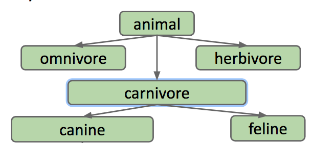
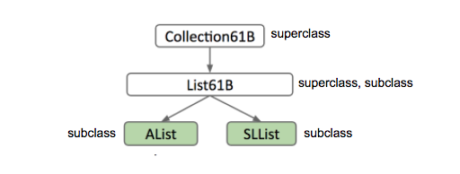
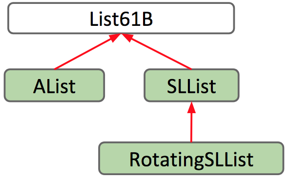

# 6 Inheritance

### The Problem

Recall the two list classes we created last week: SLList and AList. If you take a look at their documentation, you'll notice that they are very similar. In fact, all of their supporting methods are the same!

Suppose we want to write a class `WordUtils`that includes functions we can run on lists of words, including a method that calculates the longest string in an SLList.

We might end up with something like the code below

```java
public static String longest(SLList<String> list) {
    int maxDex = 0;
    for (int i = 0; i < list.size(); i += 1) {
        String longestString = list.get(maxDex);
        String thisString = list.get(i);
        if (thisString.length() > longestString.length()) {
            maxDex = i;
        }
    }
    return list.get(maxDex);
}
```

How do we make this method work for AList as well?

All we really have to do is change the method's signature: the parameter

```java
SLList<String> list
```

should be changed to

```java
AList<String> list
```

Now we have two methods in our `WordUtils` class with exactly the same method name.

```java
public static String longest(SLList<String> list)
```

and

```java
public static String longest(AList<String> list)
```

This is actually allowed in Java! It's something called _method overloading_. When you call WordUtils.longest, Java knows which one to run according to what kind of parameter you supply it. If you supply it with an AList, it will call the AList method. Same with an SLList.

It's nice that Java is smart enough to know how to deal with two of the same methods for different types, but overloading has several downsides:

* It's super repetitive and ugly, because you now have two virtually identical blocks of code.
* It's more code to maintain, meaning if you want to make a small change to the `longest` method such as correcting a bug, you need to change it in the method for each type of list.
* If we want to make more list types, we would have to copy the method for every new list class.

### Hypernyms, Hyponyms, and Interface Inheritance

In the English language and life in general, there exist logical hierarchies to words and objects.

Dog is what is called a _hypernym of_ poodle, malamute, husky, etc. In the reverse direction, poodle, malamute, and husky, are _hyponyms_ of dog.

These words form a hierarchy of "is-a" relationships:

* a poodle "is-a" dog
* a dog "is-a" canine
* a canine "is-a" carnivore
* a carnivore "is-an" animal



The same hierarchy goes for SLLists and ALists! SLList and AList are both hyponyms of a more general list.

We will formalize this relationship in Java: if a SLList is a hyponym of List61B, then the SLList class is a **subclass** of the List61B class and the List61B class is a **superclass** of the SLList class.

**Figure 4.1.1** 

In Java, in order to _express_ this hierarchy, we need to do **two things**:

* Step 1: Define a type for the general list hypernym -- we will choose the name List61B.
* Step 2: Specify that SLList and AList are hyponyms of that type.

The new List61B is what Java calls an **interface**. It is essentially a contract that specifies what a list must be able to do, but it doesn't provide any implementation for those behaviors. Can you think of why?

Here is our List61B interface. At this point, we have satisfied the first step in establishing the relationship hierarchy: creating a hypernym.

```java
public interface List61B<Item> {
    public void addFirst(Item x);
    public void add Last(Item y);
    public Item getFirst();
    public Item getLast();
    public Item removeLast();
    public Item get(int i);
    public void insert(Item x, int position);
    public int size();
}
```

Now, to complete step 2, we need to specify that AList and SLList are hyponyms of the List61B class. In Java, we define this relationship in the class definition.

We will add to

`public class AList<Item> {...}`

a relationship-defining word: implements.

`public class AList<Item> implements List61B<Item>{...}`

`implements List61B<Item>` is essentially a promise. AList is saying "I promise I will have and define all the attributes and behaviors specified in the List61B interface"

Now we can edit our `longest` method in `WordUtils` to take in a List61B. Because AList and SLList share an "is-a" relationship.

### Overriding

We promised we would implement the methods specified in List61B in the AList and SLList classes, so let's go ahead and do that.

When implementing the required functions in the subclass, it's useful \(and actually required in 61B\) to include the `@Override` tag right on top of the method signature. Here, we have done that for just one method.

```java
@Override
public void addFirst(Item x) {
    insert(x, 0);
}
```

It is good to note that even if you don’t include this tag, you _are_ still overriding the method. So technically, you don't _have_ to include it. However, including the tag acts as a safeguard for you as the programmer by alerting the compiler that you intend to override this method. Why would this be helpful you ask? Well, it's kind of like having a proofreader! The compiler will tell you if something goes wrong in the process.

Say you want to override the `addLast` method. What if you make a typo and accidentally write `addLsat`? If you don't include the @Override tag, then you might not catch the mistake, which could make debugging a more difficult and painful process. Whereas if you include @Override, the compiler will stop and prompt you to fix your mistakes before your program even runs.

### Interface Inheritance

Interface Inheritance refers to a relationship in which a subclass inherits all the methods/behaviors of the superclass. As in the List61B class we defined in the **Hyponyms and Hypernyms** section, the interface includes all the method signatures, but not implementations. It's up to the subclass to actually provide those implementations.

This inheritance is also multi-generational. This means if we have a long lineage of superclass/subclass relationships like in **Figure 4.1.1**, AList not only inherits the methods from List61B but also every other class above it all the way to the highest superclass AKA AList inherits from Collection.

## GRoE

Recall the Golden Rule of Equals we introduced in an earlier chapter. This means whenever we make an assignment `a = b` , we copy the bits from b into a, with the requirement that b is the same type as a. You can't assign `Dog b = 1` or `Dog b = new Cat()` because 1 is not a Dog and neither is Cat.

Let's try to apply this rule to the `longest` method we wrote previously in this chapter.

`public static String longest(List61B<String> list)` takes in a List61B. We said that this could take in AList and SLList as well, but how is that possible since AList and List61B are different classes? Well, recall that AList shares an "is-a" relationship with List61B, Which means an AList should be able to fit into a List61B box!


### Implementation Inheritance

Previously, we had an interface List61B that only had method headers identifying **what** List61B's should do. But, now we will see that we can write methods in List61B that already have their implementation filled out. These methods identify **how** hypernyms of List61B should behave.

In order to do this, you must include the `default` keyword in the method signature.

If we define this method in List61B

```java
default public void print() {
    for (int i = 0; i < size(); i += 1) {
        System.out.print(get(i) + " ");
    }
    System.out.println();
}
```

Then everything that implements the List61B class can use the method!

However, there is one small inefficiency in this method. Can you catch it?

For an SLList, the `get` method needs to jump through the entirety of the list. during each call. It's much better to just print while jumping through!

We want SLList to print a different way than the way specified in its interface. To do this, we need to override it. In SLList, we implement this method;

```java
@Override
public void print() {
    for (Node p = sentinel.next; p != null; p = p.next) {
        System.out.print(p.item + " ");
    }
}
```

Now, whenever we call print\(\) on an SLList, it will call this method instead of the one in List61B.

You may be wondering, how does Java know which print\(\) to call? Good question. Java is able to do this due to something called **dynamic method selection**.

We know that variables in java have a type.

`List61B<String> lst = new SLList<String>();`

In the above declaration and instantiation, lst is of type "List61B". This is called the "static type"

However, the objects themselves have types as well. the object that lst points to is of type SLList. Although this object is intrinsically an SLList \(since it was declared as such\), it is also a List61B, because of the “is-a” relationship we explored earlier. But, because the object itself was instantiated using the SLList constructor, We call this its "dynamic type".

Aside: the name “dynamic type” is actually quite semantic in its origin! Should lst be reassigned to point to an object of another type, say a AList object, lst’s dynamic type would now be AList and not SLList! It’s dynamic because it changes based on the type of the object it’s currently referring to.

When Java runs a method that is overriden, it searches for the appropriate method signature in it's **dynamic type** and runs it.

**IMPORTANT: This does not work for overloaded methods!**

Say there are two methods in the same class

```java
public static void peek(List61B<String> list) {
    System.out.println(list.getLast());
}
public static void peek(SLList<String> list) {
    System.out.println(list.getFirst());
}
```

and you run this code

```java
SLList<String> SP = new SLList<String>();
List61B<String> LP = SP;
SP.addLast("elk");
SP.addLast("are");
SP.addLast("cool");
peek(SP);
peek(LP);
```

The first call to peek\(\) will use the second peek method that takes in an SLList. The second call to peek\(\) will use the first peek method which takes in a List61B. This is because the only distinction between two overloaded methods is the types of the parameters. When Java checks to see which method to call, it checks the **static type** and calls the method with the parameter of the same type.

### Interface Inheritance vs Implementation Inheritance

How do we differentiate between "interface inheritance" and "implementation inheritance"? Well, you can use this simple distinction:

* Interface inheritance \(what\): Simply tells what the subclasses should be able to do. 
  * EX\) all lists should be able to print themselves, how they do it is up to them.
* Implementation inheritance \(how\): Tells the subclasses how they should behave. 
  * EX\) Lists should print themselves exactly this way: by getting each element in order and then printing them.

When you are creating these hierarchies, remember that the relationship between a subclass and a superclass should be an "is-a" relationship. AKA Cat should only implement Animal Cat **is an** Animal. You should not be defining them using a "has-a" relationship. Cat **has-a** Claw, but Cat definitely should not be implementing Claw.

Finally, Implementation inheritance may sound nice and all but there are some drawbacks:

* We are fallible humans, and we can't keep track of everything, so it's possible that you overrode a method but forgot you did.
* It may be hard to resolve conflicts in case two interfaces give conflicting default methods.
* It encourages overly complex code.

## Extends

Now you've seen how we can use the `implements` keyword to define a hierarchical relationship with interfaces. What if we wanted to define a hierarchical relationship between classes?

Suppose we want to build a RotatingSLList that has the same functionality as the SLList like `addFirst`, `size`, etc., but with an additional `rotateRight` operation to bring the last item to the front of the list.

One way you could do this would be to copy and paste all the methods from SLList and write `rotateRight` on top of it all - but then we wouldn't be taking advantage of the power of inheritance! Remember that inheritance allows subclasses to _reuse_ code from an already defined class. So let's define our RotatingSLList class to inherit from SLList.

We can set up this inheritance relationship in the class header, using the `extends` keyword like so:

```java
public class RotatingSLList<Item> extends SLList<Item>
```

In the same way that AList shares an "is-a" relationship with List61B, RotatingSLList shares an "is-a" relationship SLList. The `extends` keyword lets us keep the original functionality of SLList, while enabling us to make modifications and add additional functionality.



Now that we've defined our RotatingSLList to extend from SLList, let's give it its unique ability to rotate.

```java
public void rotateRight() {
    Item x = removeLast();
    addFirst(x);
}
```

You might have noticed that we were able to use methods defined outside of RotatingSLList, because we used the `extends` keyword to inherit them from SLList. That gives rise to the question: What exactly do we inherit?

By using the `extends` keyword, subclasses inherit all **members** of the parent class. "Members" includes:

* All instance and static variables
* All methods
* All nested classes

Note that constructors are not inherited, and private members cannot be directly accessed by subclasses.

### VengefulSLList

Notice that when someone calls `removeLast` on an SLList, it throws that value away - never to be seen again. But what if those removed values left and started a massive rebellion against us? In this case, we need to remember what those removed \(or rather defected &gt;:\(\) values were so we can hunt them down and terminate them later.

We create a new class, VengefulSLList, that remembers all items that have been banished by `removeLast`.

Like before, we specify in VengefulSLList's class header that it should inherit from SLList.

```java
public class VengefulSLList<Item> extends SLList<Item>
```

Now, let's give VengefulSLList a method to print out all of the items that have been removed by a call to the `removeLast` method, `printLostItems()`. We can do this by adding an instance variable that can keep track of all the deleted items. If we use an SLList to keep track of our items, then we can simply make a call to the `print()` method to print out all the items.

So far this is what we have:

```java
public class VengefulSLList<Item> extends SLList<Item> {
    SLList<Item> deletedItems;

    public void printLostItems() {
        deletedItems.print();
    }
}
```

VengefulSLList's `removeLast` should do exactly the same thing that SLList's does, except with one additional operation - adding the removed item to the `deletedItems` list. In an effort to _reuse_ code, we can **override** the `removeLast` method to modify it to fit our needs, and call the `removeLast` method defined in the parent class, SLList, using the `super` keyword.

Finally, VengefulSLList remembers all items deleted from it, as intended.

```java
public class VengefulSLList<Item> extends SLList<Item> {
    SLList<Item> deletedItems;

    public VengefulSLList() {
        deletedItems = new SLList<Item>();
    }

    @Override
    public Item removeLast() {
        Item x = super.removeLast();
        deletedItems.addLast(x);
        return x;
    }

    /** Prints deleted items. */
    public void printLostItems() {
        deletedItems.print();
    }
}
```

### Constructors Are Not Inherited

As we mentioned earlier, subclasses inherit all members of the parent class, which includes instance and static variables, methods, and nested classes, but does _not_ include constructors.

While constructors are not inherited, Java requires that all constructors  **must start with a call to one of its superclass's constructors**.

To gain some intuition on why that it is, recall that the `extends` keywords defines an "is-a" relationship between a subclass and a parent class. If a VengefulSLList "is-an" SLList, then it follows that every VengefulSLList must be set up like an SLList.

Here's a more in-depth explanation. Let's say we have two classes:

```java
public class Human {...}
```

```java
public class TA extends Human {...}
```

It is logical for TA to extend Human, because all TA's are Human. Thus, we want TA's to inherit the attributes and behaviors of Humans.

If we run the code below:

`TA Christine = new TA();`

Then first, a Human must be created. Then, that Human can be given the qualities of a TA. It doesn't make sense for a TA to be constructed without first creating a Human first.

Thus, we can either explicitly make a call to the superclass's constructor, using the `super` keyword:

```java
public VengefulSLList() {
    super();
    deletedItems = new SLList<Item>();
}
```

Or, if we choose not to, Java will automatically make a call to the superclass's _no-argument_ constructor for us.

In this case, adding `super()` has no difference from the constructor we wrote before. It just makes explicit what was done implicitly by Java before. However, if we were to define another constructor in VengefulSLList, Java's implicit call may not be what we intend to call.

Suppose we had a one-argument constructor that took in an item. If we had relied on an implicit call to the superclass's _no-argument_ constructor, `super()`, the item passed in as an argument wouldn't be placed anywhere!

So, we must make an explicit call to the correct constructor by passing in the item as a parameter to super.

```java
public VengefulSLList(Item x) {
    super(x);
    deletedItems = new SLList<Item>();
}
```

### The Object Class

Every class in Java is a descendant of the Object class, or `extends` the Object class. Even classes that do not have an explicit `extends` in their class still _implicitly_ extend the Object class.

For example,

* VengefulSLList `extends` SLList explicitly in its class declaration
* SLList `extends` Object implicitly

This means that since SLList inherits all members of Object, VengefulSLList inherits all members of SLList _and_ Object, transitively. So, what is to be inherited from Object?

As seen in the [documentation for the Object class](https://docs.oracle.com/javase/8/docs/api/java/lang/Object.html), the Object class provides operations that every Object should be able to do - like `.equals(Object obj)`, `.hashCode()`, and `toString()`.



### Is-a vs. Has-a

_Important Note:_ The `extends` keyword defines "is-a", or hypernymic relationships. A common mistake is to instead use it for "has-a", or meronymic relationships.

When extending a class, a wise thing to do would be to ask yourself if the "is-a" relationship makes sense.

* `Shower` is a `Bathroom`? No!
* `VengefulSLList` is a `SLList`? Yes!

