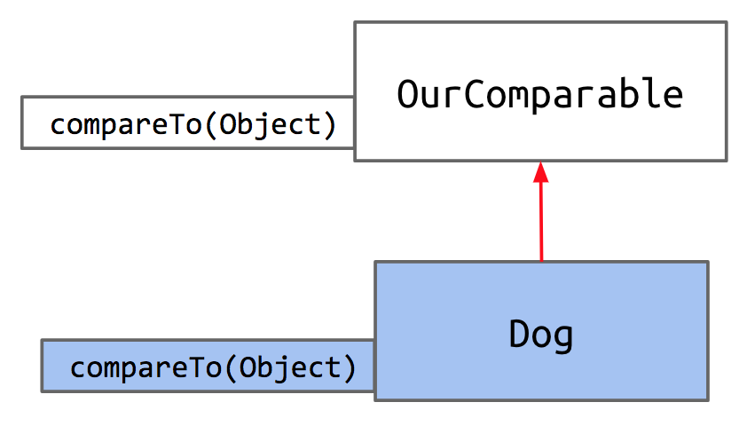
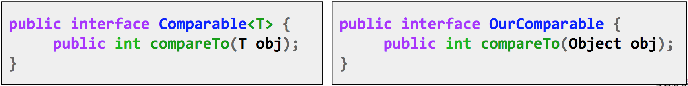
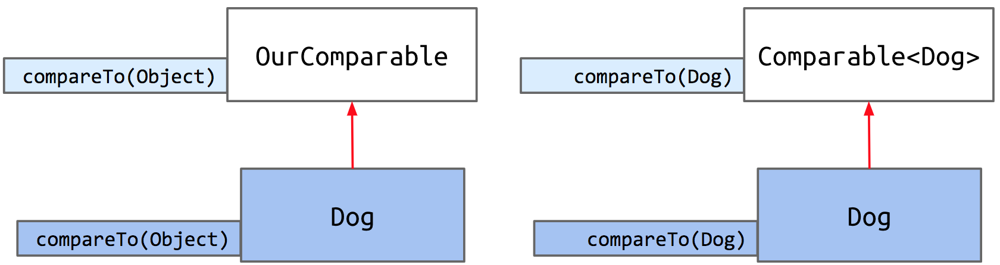
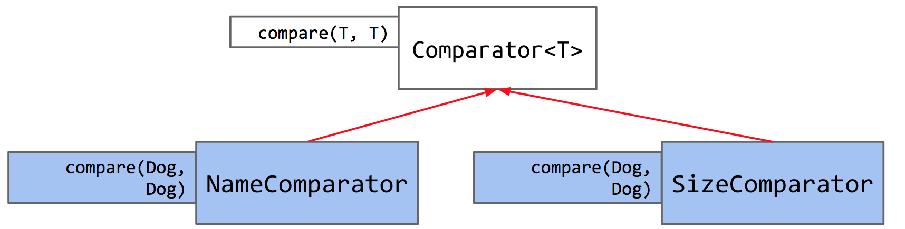

# 7 Inheritance in Practice

## Subtype Polymorphism

We've seen how inheritance lets us reuse existing code in a superclass while implementing small modifications by overriding a superclass's methods or writing brand new methods in the subclass. Inheritance also makes it possible to design general data structures and methods using _polymorphism_.

Polymorphism, at its core, means 'many forms'. In Java, polymorphism refers to how objects can have many forms or types. In object-oriented programming, polymorphism relates to how an object can be regarded as an instance of its own class, an instance of its superclass, an instance of its superclass's superclass, and so on.

Consider a variable `deque` of static type Deque. A call to `deque.addFirst()` will be determined at the time of execution, depending on the run-time type, or dynamic type, of `deque` when `addFirst` is called. As we saw in the last chapter, Java picks which method to call using dynamic method selection.

Suppose we want to write a python program that prints a string representation of the larger of two objects. There are two approaches to this.

1. Explicit HoF Approach

```python
def print_larger(x, y, compare, stringify):
    if compare(x, y):
        return stringify(x)
    return stringify(y)
```

1. Subtype Polymorphism Approach

```python
def print_larger(x, y):
    if x.largerThan(y):
        return x.str()
    return y.str()
```

Using the explicit higher order function approach, you have a common way to print out the larger of two objects. In contrast, in the subtype polymorphism approach, the object _itself_ makes the choices. The `largerFunction` that is called is dependent on what x and y actually are.

### Max Function

Say we want to write a `max` function which takes in any array - regardless of type - and returns the maximum item in the array.

```java
public static Object max(Object[] items) {
    int maxDex = 0;
    for (int i = 0; i < items.length; i += 1) {
        if (items[i] > items[maxDex]) {
            maxDex = i;
        }
    }
    return items[maxDex];
}

public static void main(String[] args) {
    Dog[] dogs = {new Dog("Elyse", 3), new Dog("Sture", 9), new Dog("Benjamin", 15)};
    Dog maxDog = (Dog) max(dogs);
    maxDog.bark();
}
```

Unfortunately, this code does not work because of this line:

```java
if (items[i] > items[maxDex]) {
```

The reason why this results in a compilation error is because this line assumes that the `>` operator works with arbitrary Object types, when in fact it does not.

Instead, one thing we could is define a `maxDog` function in the Dog class, and give up on writing a "one true max function" that could take in an array of any arbitrary type. We might define something like this:

```java
public static Dog maxDog(Dog[] dogs) {
    if (dogs == null || dogs.length == 0) {
        return null;
    }
    Dog maxDog = dogs[0];
    for (Dog d : dogs) {
        if (d.size > maxDog.size) {
            maxDog = d;
        }
    }
    return maxDog;
}
```

While this would work for now, if we give up on our dream of making a generalized `max` function and let the Dog class define its own `max` function, then we'd have to do the same for any class we define later. We'd need to write a `maxCat` function, a `maxPenguin` function, a `maxWhale` function, etc., resulting in unnecessary repeated work and a lot of redundant code.

The fundamental issue that gives rise to this is that Objects cannot be compared with `>`. This makes sense, as how could Java know whether it should use the String representation of the object, or the size, or another metric, to make the comparison? In Python or C++, the way that the `>` operator works could be redefined to work in different ways when applied to different types. Unfortunately, Java does not have this capability. Instead, we turn to interface inheritance to help us out.

We can create an interface that guarantees that any implementing class, like Dog, contains a comparison method, which we'll call `compareTo`.



Let's write our interface. We'll specify one method `compareTo`.

```java
public interface OurComparable {
    public int compareTo(Object o);
}
```

We will define its behavior like so:

* Return -1 if `this` &lt; o.
* Return 0 if `this` equals o.
* Return 1 if `this` &gt; o.

Now that we've created the `OurComparable` interface, we can require that our Dog class implements the `compareTo` method. First, we change Dog's class header to include `implements OurComparable`, and then we write the `compareTo` method according to its defined behavior above.

We use the instance variable `size` to make our comparison.

```java
public class Dog implements OurComparable {
    private String name;
    private int size;

    public Dog(String n, int s) {
        name = n;
        size = s;
    }

    public void bark() {
        System.out.println(name + " says: bark");
    }

    public int compareTo(Object o) {
        Dog uddaDog = (Dog) o;
        if (this.size < uddaDog.size) {
            return -1;
        } else if (this.size == uddaDog.size) {
            return 0;
        }
        return 1;
    }
}
```

**Notice that since `compareTo` takes in any arbitrary Object o, we have to** _**cast**_ **the input to a Dog to make our comparison using the `size` instance variable.**

Now we can generalize the `max` function we defined in exercise 4.3.1 to, instead of taking in any arbitrary array of objects, takes in `OurComparable` objects - which we know for certain all have the `compareTo` method implemented.

```java
public static OurComparable max(OurComparable[] items) {
    int maxDex = 0;
    for (int i = 0; i < items.length; i += 1) {
        int cmp = items[i].compareTo(items[maxDex]);
        if (cmp > 0) {
            maxDex = i;
        }
    }
    return items[maxDex];
}
```

Great! Now our `max` function can take in an array of any `OurComparable` type objects and return the maximum object in the array. Now, this code is admittedly quite long, so we can make it much more succinct by modifying our `compareTo` method's behavior:

* Return negative number if `this` &lt; o.
* Return 0 if `this` equals o.
* Return positive number if `this` &gt; o.

Now, we can just return the difference between the sizes. If my size is 2, and uddaDog's size is 5, `compareTo` would return -3, a negative number indicating that I am smaller.

```java
public int compareTo(Object o) {
    Dog uddaDog = (Dog) o;
    return this.size - uddaDog.size;
}
```

Using inheritance, we were able to generalize our maximization function. What are the benefits to this approach?

* No need for maximization code in every class\(i.e. no `Dog.maxDog(Dog[])` function required
* We have code that operates on multiple types \(mostly\) gracefully

## Comparables

The `OurComparable` interface that we just built works, but it's not perfect. Here are some issues with it:

* Awkward casting to/from Objects
* We made it up.
  * No existing classes implement OurComparable \(e.g. String, etc.\) 
  * No existing classes use OurComparable \(e.g. no built-in max function that uses OurComparable\)

The solution? We'll take advantage of an interface that already exists called `Comparable`. `Comparable` is already defined by Java and is used by countless libraries.

`Comparable` looks very similar to the OurComparable interface we made, but with one main difference. Can you spot it?



Notice that `Comparable<T>` means that it takes a generic type. This will help us avoid having to cast an object to a specific type! Now, we will rewrite the Dog class to implement the Comparable interface, being sure to update the generic type `T` to Dog:

```java
public class Dog implements Comparable<Dog> {
    ...
    public int compareTo(Dog uddaDog) {
        return this.size - uddaDog.size;
    }
}
```

Now all that's left is to change each instance of OurComparable in the Maximizer class to Comparable. Watch as the largest Dog says bark:

Instead of using our personally created interface `OurComparable`, we now use the real, built-in interface, `Comparable`. As a result, we can take advantage of all the libraries that already exist and use `Comparable`.



## Comparator

We've just learned about the comparable interface, which imbeds into each Dog the ability to compare itself to another Dog. Now, we will introduce a new interface that looks very similar called `Comparator`.

Let's start off by defining some terminology.

* Natural order - used to refer to the ordering implied in the `compareTo` method of a particular class.

As an example, the natural ordering of Dogs, as we stated previously, is defined according to the value of size. What if we'd like to sort Dogs in a different way than their natural ordering, such as by alphabetical order of their name?

Java's way of doing this is by using `Comparator`'s. Since a comparator is an object, the way we'll use `Comparator` is by writing a nested class inside Dog that implements the `Comparator` interface.

But first, what's inside this interface?

```java
public interface Comparator<T> {
    int compare(T o1, T o2);
}
```

This shows that the `Comparator` interface requires that any implementing class implements the `compare` method. The rule for `compare` is just like `compareTo`:

* Return negative number if o1 &lt; o2.
* Return 0 if o1 equals o2.
* Return positive number if o1 &gt; o2.

Let's give Dog a NameComparator. To do this, we can simply defer to `String`'s already defined `compareTo` method.

```java
import java.util.Comparator;

public class Dog implements Comparable<Dog> {
    ...
    public int compareTo(Dog uddaDog) {
        return this.size - uddaDog.size;
    }

    private static class NameComparator implements Comparator<Dog> {
        public int compare(Dog a, Dog b) {
            return a.name.compareTo(b.name);
        }
    }

    public static Comparator<Dog> getNameComparator() {
        return new NameComparator();
    }
}
```

Note that we've declared NameComparator to be a static class. A minor difference, but we do so because we do not need to instantiate a Dog to get a NameComparator. Let's see how this Comparator works in action.

As you've seen, we can retrieve our NameComparator like so:

```java
Comparator<Dog> nc = Dog.getNameComparator();
```

All in all, we have a Dog class that has a private NameComparator class and a method that returns a NameComparator we can use to compare dogs alphabetically by name.

Let's see how everything works in the inheritance hierarchy - we have a Comparator interface that's built-in to Java, which we can implement to define our own Comparators \(`NameComparator`, `SizeComparator`, etc.\) within Dog.



To summarize, interfaces in Java provide us with the ability to make **callbacks**. Sometimes, a function needs the help of another function that might not have been written yet \(e.g. `max` needs `compareTo`\). A callback function is the helping function \(in the scenario, `compareTo`\). In some languages, this is accomplished using explicit function passing; in Java, we wrap the needed function in an interface.

A Comparable says, "I want to compare myself to another object". It is imbedded within the object itself, and it defines the **natural ordering** of a type. A Comparator, on the other hand, is more like a third party machine that compares two objects to each other. Since there's only room for one `compareTo` method, if we want multiple ways to compare, we must turn to Comparator.

# Lists and Sets

In this course, we've already built two kinds of lists: `AList` and `SLList`. We also built an interface `List61B` to enforce specific list methods `AList` and `SLList` had to implement. You can find the code at the following links:

* [List61B](https://github.com/Berkeley-CS61B/lectureCode-sp19/blob/master/inheritance2/List61B.java)
* [AList](https://github.com/Berkeley-CS61B/lectureCode-sp19/blob/master/inheritance1/AList.java)
* [SLList](https://github.com/Berkeley-CS61B/lectureCode-sp19/blob/master/inheritance2/SLList.java)

This is how we might use `List61B` type:

```java
List61B<Integer> L = new AList<>();
L.addLast(5);
L.addLast(10);
L.addLast(15);
L.print();
```

## Lists in Real Java Code

We built a list from scratch, but Java provides a built-in `List` interface and several implementations, e.g. `ArrayList`. Remember, since `List` is an interface we can't instatiate it! We must instatiate one of its implementations.

To access this, we can use the full name \('canonical name'\) of classes, interfaces:

```java
java.util.List<Integer> L = new java.util.ArrayList<>();
```

However this is a bit verbose. In a similar way to how we import `JUnit`, we can import java libraries:

```java
import java.util.List;
import java.util.ArrayList;

public class Example {
    public static void main(String[] args) {
        List<Integer> L = new ArrayList<>();
        L.add(5);
        L.add(10);
        System.out.println(L);
    }
}
```

## Sets

Sets are a collection of unique elements - you can only have one copy of each element. There is also no sense of order.

### Java

Java has the `Set` interface along with implementations, e.g. `HashSet`. Remember to import them if you don't want to use the full name!

```java
import java.util.Set;
import java.util.HashSet;
```

Example use:

```java
Set<String> s = new HashSet<>();
s.add("Tokyo");
s.add("Lagos");
System.out.println(S.contains("Tokyo")); // true
```

### Python

In python, we simply call `set()`. To check for `contains` we don't use a method but the keyword `in`.

```python
s = set()
s.add("Tokyo")
s.add("Lagos")
print("Tokyo" in s) // True
```

## ArraySet

Our goal is to make our own set, `ArraySet`, with the following methods:

* `add(value)`: add the value to the set if not already present
* `contains(value)`: check to see if ArraySet contains the key
* `size()`: return number of values

Here is our code as of now:

```java
import java.util.Iterator;

public class ArraySet<T> implements Iterable<T> {
    private T[] items;
    private int size; // the next item to be added will be at position size

    public ArraySet() {
        items = (T[]) new Object[100];
        size = 0;
    }

    /* Returns true if this map contains a mapping for the specified key.
     */
    public boolean contains(T x) {
        for (int i = 0; i < size; i += 1) {
            if (items[i].equals(x)) {
                return true;
            }
        }
        return false;
    }

    /* Associates the specified value with the specified key in this map. */
    public void add(T x) {
        if (contains(x)) {
            return;
        }
        items[size] = x;
        size += 1;
    }

    /* Returns the number of key-value mappings in this map. */
    public int size() {
        return size;
    }
}
```

We can use a clean enhanced for loop with Java's `HashSet`

```java
Set<String> s = new HashSet<>();
s.add("Tokyo");
s.add("Lagos");
for (String city : s) {
    System.out.println(city);
}
```

However, if we try to do the same with our `ArraySet`, we get an error. How can we enable this functionality?

## Enhanced For Loop

Let's first understand what is happening when we use an enhanced for loop. We can "translate" an enhanced for loop into an ugly, manual approach.

```java
Set<String> s = new HashSet<>();
...
for (String city : s) {
    ...
}
```

The above code translates to:

```java
Set<String> s = new HashSet<>();
...
Iterator<String> seer = s.iterator();
while (seer.hasNext()) {
    String city = seer.next();
    ...
}
```

Let’s strip away the magic so we can build our own classes that support this.

The key here is an object called an _iterator_.

For our example, in List.java we might define an `iterator()` method that returns an iterator object.

```java
public Iterator<E> iterator();
```

Now, we can use that object to loop through all the entries in our list:

```java
List<Integer> friends = new ArrayList<Integer>();
...
Iterator<Integer> seer = friends.iterator();

while (seer.hasNext()) {
System.out.println(seer.next());
}
```

This code behaves identically to the foreach loop version above.

There are three key methods in our iterator approach:

First, we get a new iterator object with `Iterator<Integer> seer = friends.iterator();`

Next, we loop through the list with our while loop. We check that there are still items left with `seer.hasNext()`, which will return true if there are unseen items remaining, and false if all items have been processed.

Last, `seer.next()` does two things at once. It returns the next element of the list, and here we print it out. It also advances the iterator by one item. In this way, the iterator will only inspect each item once.

## Implementing Iterators

In this section, we are going to talk about how to build a class to support iteration.

Let's start by thinking about what the compiler need to know in order to successfully compile the following iterator example:

```java
List<Integer> friends = new ArrayList<Integer>();
Iterator<Integer> seer = friends.iterator();

while(seer.hasNext()) {
    System.out.println(seer.next());
}
```

We can look at the static types of each object that calls a relevant method. `friends` is a List, on which `iterator()` is called, so we must ask:

* Does the List interface have an iterator\(\) method?

`seer` is an Iterator, on which `hasNext()` and `next()` are called, so we must ask:

* Does the Iterator interface have next/hasNext\(\) methods?

So how do we implement these requirements?

The List interface extends the Iterable interface, inheriting the abstract iterator\(\) method. \(Actually, List extends Collection which extends Iterable, but it's easier to codethink of this way to start.\)

```java
public interface Iterable<T> {
    Iterator<T> iterator();
}
```

```java
public interface List<T> extends Iterable<T>{
    ...
}
```

Next, the compiler checks that Iterators have `hasNext()` and `next()`. The Iterator interface specifies these abstract methods explicitly:

```java
public interface Iterator<T> {
    boolean hasNext();
    T next();
}
```

### What if someone calls `next` when `hasNext` returns false?

```text
This behavior is undefined. However, a common convention is to throw a `NoSuchElementException`. See [Discussion 5](https://sp19.datastructur.es/materials/discussion/disc05sol.pdf) for examples.
```

### Will `hasNext` always be called before `next`?

```text
Not necessarily. This is sometimes the case when someone using the iterator knows exactly how many elements are in the sequence. Thus, we can't rely on the user calling `hasNext` before `next`. However, you can always call `hasNext` from within your `next` function.
```

Specific classes will implement their own iteration behaviors for the interface methods. Let's look at an example. \(Note: if you want to build this up from the start, follow along with the live coding in the video.\)

We are going to add iteration through keys to our ArrayMap class. First, we write a new class called ArraySetIterator, nested inside of ArraySet:

```java
private class ArraySetIterator implements Iterator<T> {
    private int wizPos;

    public ArraySetIterator() {
        wizPos = 0;
    }

    public boolean hasNext() {
        return wizPos < size;
    }

    public T next() {
        T returnItem = items[wizPos];
        wizPos += 1;
        return returnItem;
    }
}
```

This ArraySetIterator implements a `hasNext()` method, and a `next()` method, using a `wizPos` position as an index to keep track of its position in the array. For a different data structure, we might implement these two methods differently.

**Thought Excercise:** How would you design `hasNext()` and `next()` for a linked list?

Now that we have the appropriate methods, we could use a ArraySetIterator to iterate through an ArrayMap:

```java
ArraySet<Integer> aset = new ArraySet<>();
aset.add(5);
aset.add(23);
aset.add(42);

Iterator<Integer> iter = aset.iterator();

while(iter.hasNext()) {
    System.out.println(iter.next());
}
```

We still want to be able to support the enhanced for loop, though, to make our calls cleaner. So, we need to make ArrayMap implement the Iterable interface. The essential method of the Iterable interface is `iterator()`, which returns an Iterator object for that class. All we have to do is return an instance of our `ArraySetIterator` that we just wrote!

```java
public Iterator<T> iterator() {
    return new ArraySetIterator();
}
```

Now we can use enhanced for loops with our `ArrraySet`!

```java
ArraySet<Integer> aset = new ArraySet<>();
...
for (int i : aset) {
    System.out.println(i);
}
```

Here we've seen **Iterable**, the interface that makes a class able to be iterated on, and requires the method `iterator()`, which returns an Iterator object. And we've seen **Iterator**, the interface that defines the object with methods to actually do that iteration. You can think of an Iterator as a machine that you put onto an iterable that facilitates the iteration. Any iterable is the object on which the iterator is performing.

With these two components, you can make fancy for loops for your classes!

`ArraySet` code with iteration support is below:

```java
import java.util.Iterator;

public class ArraySet<T> implements Iterable<T> {
    private T[] items;
    private int size; // the next item to be added will be at position size

    public ArraySet() {
        items = (T[]) new Object[100];
        size = 0;
    }

    /* Returns true if this map contains a mapping for the specified key.
     */
    public boolean contains(T x) {
        for (int i = 0; i < size; i += 1) {
            if (items[i].equals(x)) {
                return true;
            }
        }
        return false;
    }

    /* Associates the specified value with the specified key in this map.
       Throws an IllegalArgumentException if the key is null. */
    public void add(T x) {
        if (x == null) {
            throw new IllegalArgumentException("can't add null");
        }
        if (contains(x)) {
            return;
        }
        items[size] = x;
        size += 1;
    }

    /* Returns the number of key-value mappings in this map. */
    public int size() {
        return size;
    }

    /** returns an iterator (a.k.a. seer) into ME */
    public Iterator<T> iterator() {
        return new ArraySetIterator();
    }

    private class ArraySetIterator implements Iterator<T> {
        private int wizPos;

        public ArraySetIterator() {
            wizPos = 0;
        }

        public boolean hasNext() {
            return wizPos < size;
        }

        public T next() {
            T returnItem = items[wizPos];
            wizPos += 1;
            return returnItem;
        }
    }

    public static void main(String[] args) {
        ArraySet<Integer> aset = new ArraySet<>();
        aset.add(5);
        aset.add(23);
        aset.add(42);

        //iteration
        for (int i : aset) {
            System.out.println(i);
        }
    }

}
```
